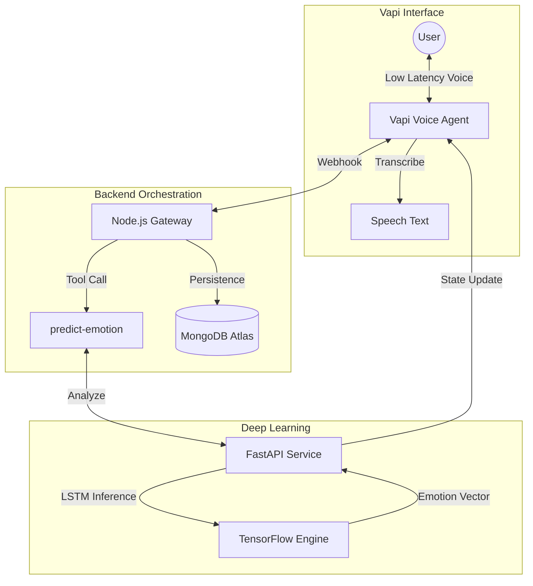
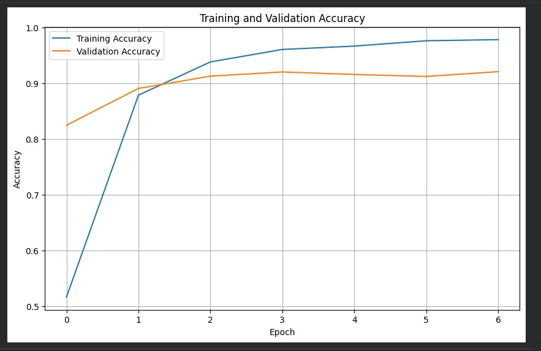
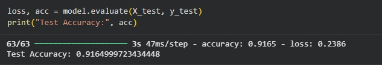

# MindSync AI: Emotionally Intelligent Conversational Agent

MindSync AI is a technical implementation of a real-time, emotionally aware voice assistant. It leverages a custom-trained **Bi-Directional LSTM (Long Short-Term Memory)** model and the **Vapi Conversational Platform** to provide empathetic, supportive interactions for individuals seeking emotional guidance.

## Architecture Flow

This diagram illustrates the integrated flow between the user's voice, the Vapi gateway, and the Deep Learning analytical engine.



## Societal Impact and Research Context

The development of MindSync AI addresses a critical bottleneck in global mental healthcare infrastructure.

- **Global Health Crisis**: According to the **World Health Organization (WHO)**, approximately 1 in 4 people globally will be affected by mental or neurological disorders.
- **Access Deficit**: Nearly **70% of individuals** with mental health conditions lack access to professional care due to cost and scheduling barriers.
- **AI Screening Efficacy**: Empirical studies suggest that automated screening tools using **Deep Learning** improve early detection accuracy by up to **30%** over standard linear models.

MindSync AI provides a scalable "First-Response" system that listens, empathizes, and predicts emotional states to support help-seeking behavior.

## Project Technical Documentation
Access detailed technical specifications via the links below:
- [**System Architecture Specification**](./docs/architecture.md): Integration of Vapi, Node.js, and FastAPI.
- [**Machine Learning Pipeline**](./docs/ml_pipeline.md): Bidirectional LSTM (Bi-LSTM) and TensorFlow implementation.
- [**Research and Literature Review**](./docs/research.md): Deep search into LSTMs and Conversational Behavioral Health.

## Model Performance and Validation

The model is trained on the [**Emotions Dataset for NLP**](https://www.kaggle.com/datasets/praveengovi/emotions-dataset-for-nlp) (20,000+ samples), reaching **~92% Accuracy**.

| Training Curves | Test Metrics & Results |
| :---: | :---: |
|  |  |

## Services Setup

### 1. AI Analysis Service (FastAPI)
```bash
cd ai-service
pip install -r requirements.txt
python main.py
```

### 2. Backend Orchestrator (Node.js)
```bash
cd backend
npm install
npm run dev
```

### 3. Vapi Integration
Configure your `VAPI_API_KEY` in `backend/.env` and run the assistant creation script:
```bash
cd backend
node setupVapi.js
```

---
*Developed for research into the intersection of Deep Learning pipelines and real-time Conversational AI.*
