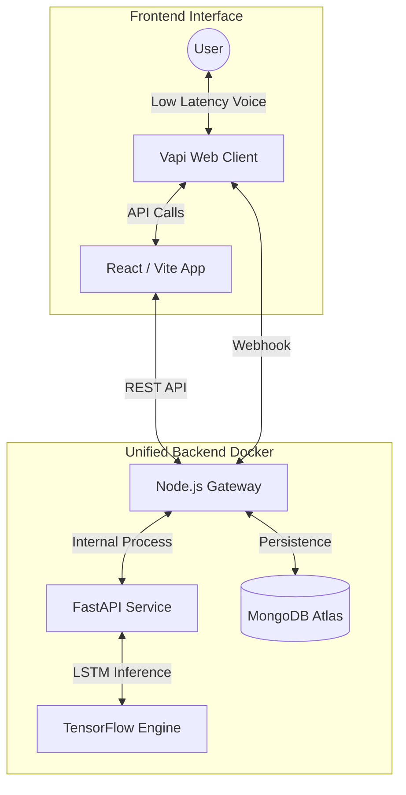

# MindSync AI: Emotionally Intelligent Voice Assistant

**MindSync AI** is a real-time, emotionally aware voice companion. It uses a custom-trained **Bi-Directional LSTM (Long Short-Term Memory)** model to detect user emotions through speech and adapts its personality in real-time using the **Vapi Conversational Platform**.

---

### 🚀 Live Application
*   **Production Frontend**: [https://nlp-voice-emotion-analyzer-1.onrender.com](https://nlp-voice-emotion-analyzer-1.onrender.com)
*   **Infrastructure Gateway (API)**: [https://nlp-voice-emotion-analyzer.onrender.com](https://nlp-voice-emotion-analyzer.onrender.com)

---

### 🏗️ System Architecture

MindSync AI follows a unified monorepo structure with a Dockerized backend for high-performance inference.



---

### 🛠️ Technical Stack

-   **AI Interface**: Vapi (Speech-to-Text, Text-to-Speech, Voice Gateway)
*   **Neural Architecture**: Bi-Directional LSTM (TensorFlow/Keras)
-   **Backend**: Node.js (Orchestrator) & FastAPI (AI Inference)
-   **Database**: MongoDB Atlas (Session & Emotion Tracking)
-   **Frontend**: React.js with Framer Motion (Glassmorphic Dashboard)
-   **Deployment**: Dockerized on Render (Unified Environment)

---

### 📂 Repository Structure

*   **/frontend**: React client with dynamic emotional analytics.
*   **/backend**:
    *   **server.js**: Node.js gateway that manages the Python AI process.
    *   **/ai-services**: Python FastAPI service running the LSTM model.
*   **/docs**: Detailed research papers, training logs, and architecture specs.
*   **/Training**: Juypter notebooks used for model development and evaluation.

---

### ⚙️ Quick Start (Local Development)

#### 1. Configure Environment
Create a `.env` file in both `/backend` and `/frontend` using the provided `.env.example` templates.

#### 2. Run Unified Backend
```bash
cd backend
npm install
pip install -r ai-services/requirements.txt
npm run dev
```

#### 3. Run Frontend
```bash
cd frontend
npm install
npm run dev
```

---

### 📊 Research & Validation
The model is trained on a dataset of **20,000+ samples**, achieving a validation accuracy of **~92%**. It covers primary emotional vectors including Joy, Sadness, Anger, Fear, and Surprise.

| Training Performance | Inference Confidence |
| :---: | :---: |
|  |  |

---
*Developed for research into the intersection of Deep Learning pipelines and real-time Conversational Behavioral Health.*
