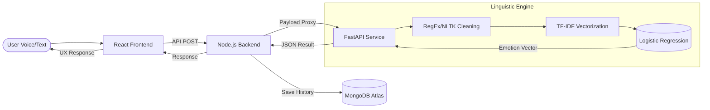
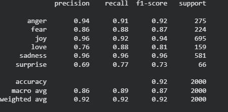

# MindSync AI: Intelligent Emotion Analysis and Therapeutic Feedback System

MindSync AI is a technical implementation of a real-time emotion recognition pipeline designed to bridge the gap between digital interaction and mental health support. By integrating Linguistic Analysis with a Decoupled Microservices Architecture, the system provides high-fidelity emotional classification and low-latency feedback.

## Architecture Flow

This diagram illustrates the end-to-end data transmission and processing lifecycle within the MindSync AI ecosystem.



## Societal Impact and Research Context

The development of MindSync AI addresses a critical bottleneck in global mental healthcare infrastructure.

- **Global Health Crisis**: According to the **World Health Organization (WHO)**, approximately 1 in 4 people globally will be affected by mental or neurological disorders at some point in their lives.
- **Access Deficit**: Research indicates a significant "treatment gap," where nearly **70% of individuals** with mental health conditions in low-to-middle income countries lack access to professional care.
- **AI Screening Efficacy**: Empirical studies suggest that automated screening tools can improve early detection of anxiety and depression by up to **25-30%** when used alongside traditional clinical observation.

MindSync AI serves as a scalable, first-contact screening tool that reduces the barrier to entry for help-seeking individuals by providing interactive emotional assessment.

## Project Visuals and Technical Validation

### 📊 Dataset Overview
Analysis of the emotion class distribution used for model training.


### 📈 Model Performance
Training progress and final test accuracy metrics.

| Training & Validation Accuracy | Confusion Matrix & Test Metrics |
| :---: | :---: |
|  |  |

## Technical Documentation Suite

Detailed technical specifications and research foundations are documented in the following modules:

- [**System Architecture Specification**](./docs/architecture.md): Deep dive into the Decoupled Microservices design.
- [**Machine Learning Pipeline**](./docs/ml_pipeline.md): Comprehensive breakdown of n-gram vectorization and linear classification.
- [**Research and Literature Review**](./docs/research.md): Academic context and comparative model studies.

---

## Deployment Guide

### AI Engine (FastAPI)
```bash
cd ai-service
pip install -r requirements.txt
python main.py
```

### Backend Orchestrator (Node.js)
```bash
cd backend
npm install
npm start
```

### Frontend (React/Vite)
```bash
cd frontend
npm install
npm run dev
```

---
*Developed as a project-based exploration into Automated Emotional Assessment and its role in modern behavioral health technology.*
