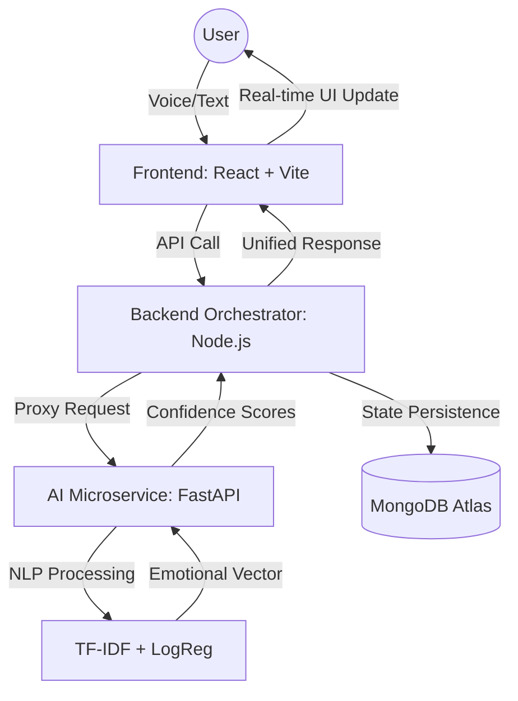

# System Architecture

MindSync AI follows a decoupled microservices architecture, separating the user interface, the orchestration logic, and the specialized AI processing engine. This design ensures that the machine learning model can be scaled or updated independently of the web application.

## System Workflow Diagram

## Core Components

### 1. Frontend Implementation
- **Role**: Client interface and real-time interaction.
- **Technologies**: React Hooks, Axios, Web Speech API Standard.
- **Specification**: High-frequency state management for the therapy session interface, handling local audio-to-text transcription to minimize latency before transmission.

### 2. Backend Orchestration
- **Role**: API Gateway and Data Persistence.
- **Technologies**: Express.js, JWT (Authentication), Mongoose (ODM).
- **Function**: Manages the session lifecycle. It acts as a secure buffer between the client and the AI service, ensuring data integrity and long-term storage in MongoDB.

### 3. AI Service (Linguistic Engine)
- **Role**: Deep Linguistic Analysis and Emotion Classification.
- **Technologies**: FastAPI, Scikit-learn, NLTK.
- **Performance**: Sub-50ms inference time achieved through model serialization using Joblib.

## Data Sequence
1. **Acquisition**: Voice input is converted to text via browser-level Web Speech API.
2. **Transmission**: The React client transmits the transcript to the primary backend.
3. **Internal Proxy**: Node.js performs a synchronous POST request to the Python service.
4. **Classification**: The Python service applies preprocessing, TF-IDF vectorization, and predicts emotion class probabilities.
5. **Persistence**: The resulting emotional vector and confidence score are logged in the database session.
6. **Resolution**: The analyzed response is returned to the client for UI rendering.

## Infrastructure Specifications
- **Database**: MongoDB Atlas Cluster (Cloud Infrastructure).
- **Environment Management**: Isolated .env configurations for dev/prod environments.
- **Protocol**: HTTP/REST with shared JSON schemas for cross-language compatibility.
