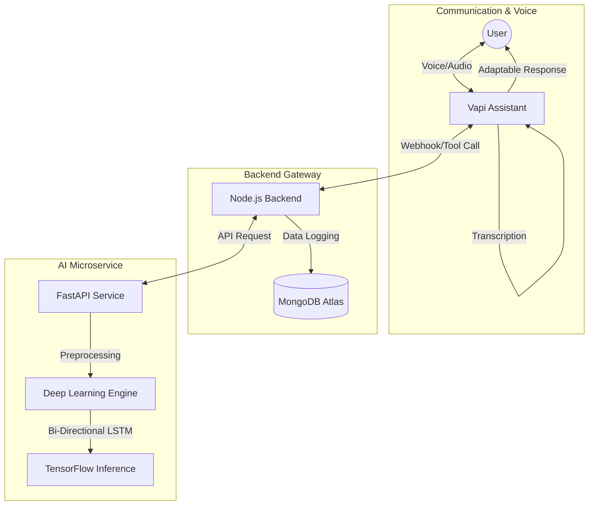

# System Architecture

MindSync AI follows a distributed microservices architecture designed for real-time emotional intelligence. The system separates high-latency voice processing (Vapi) from the core logic (Node.js) and the specialized analytical engine (FastAPI + TensorFlow).

## System Workflow Diagram

## Core Components

### 1. Conversational Voice Layer (Vapi)
- **Assistant**: An emotionally intelligent agent powered by OpenAI's GPT-4-turbo-preview.
- **Tools**: Implements the `predict-emotion` function, which Vapi is instructed to call every time the user speaks to align its tone and empathy.
- **Voice/Transcriber**: High-fidelity audio using PlayHT (Voice) and Deepgram (Transcriber) for sub-second latency.

### 2. Backend Orchestrator (Node.js + Express)
- **Role**: State management and Vapi Webhook handler.
- **Webhook Logic**: Processes `tool-calls` from Vapi, proxies the text to the AI engine, and saves the emotional vectors to MongoDB for session tracking.
- **Persistence**: Mongoose (ODM) records every interaction, which is later visualized in the user dashboard.

### 3. AI Service (Deep Learning Engine)
- **Role**: Sequence-aware emotion classification.
- **Stack**: FastAPI, TensorFlow/Keras, NLTK.
- **Inference**: Loads a serialized `.h5` model (Bidirectional LSTM) to analyze the emotional nuance and probability of input text.

## Data Movement Sequence
1. **Input**: User speaks to the Vapi Assistant.
2. **Transcription**: Deepgram generates a text transcript in real-time.
3. **Execution**: Vapi triggers the `predict-emotion` tool via the Node.js webhook.
4. **Analysis**: Node.js calls the FastAPI service where the TensorFlow model predicts one of 6 emotions (Anger, Fear, Joy, Love, Sadness, Surprise).
5. **Adjustment**: Vapi receives the emotion name and dynamically adjusts its prompt instructions to be more empathetic or supportive.
6. **Persistence**: The full message, emotion, and confidence score are saved to MongoDB.

## Infrastructure
- **Server**: Node.js (Gateway) and FastAPI (AI).
- **External Services**: Vapi, Deepgram, PlayHT, MongoDB Atlas.
- **Connectivity**: Global REST APIs and Webhook protocols.
