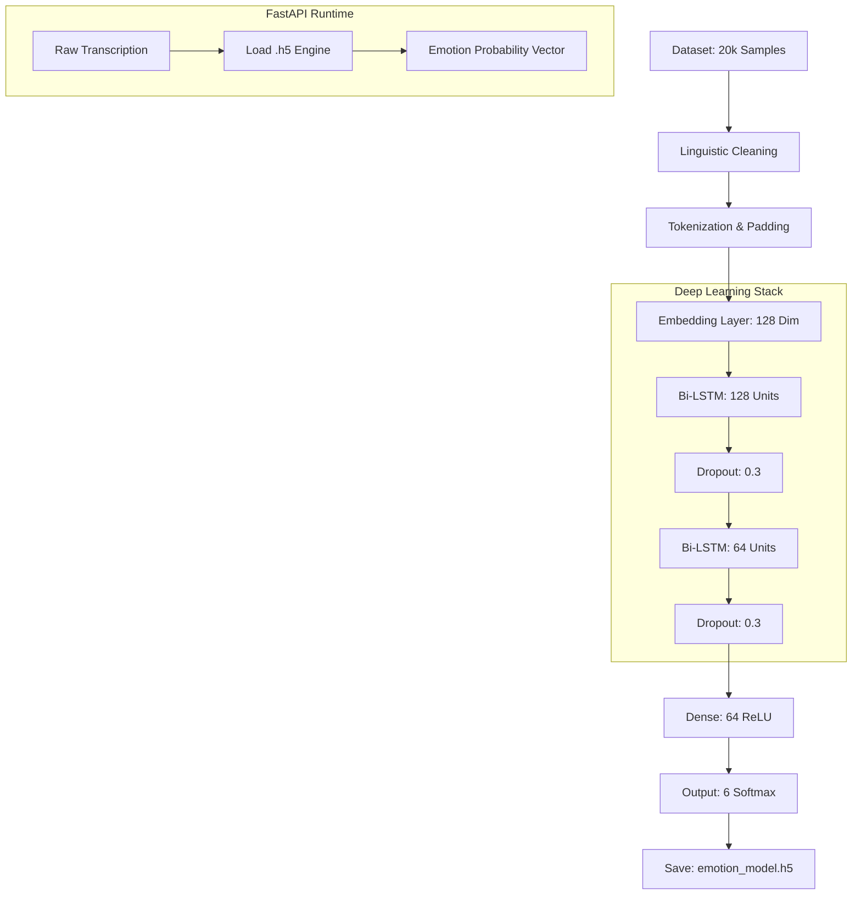

# Machine Learning Pipeline Specification

The MindSync AI emotion analysis engine has evolved from classic linear models into a **Bidirectional Long Short-Term Memory (Bi-LSTM)** architecture. This allows the system to capture complex sequential dependencies and "long-range" emotional context in human speech.

## Pipeline Lifecycle Diagram

## Technical Processing Workflow

### 1. Data Source and Augmentation
The pipeline utilizes a high-volume dataset from Kaggle: [**Emotions Dataset for NLP**](https://www.kaggle.com/datasets/praveengovi/emotions-dataset-for-nlp).
- **Volume**: ~20k Samples (Train: 16k, Val: 2k, Test: 2k).
- **Labels**: 6 distinct emotion classes: Anger, Fear, Joy, Love, Sadness, Surprise.
- **Normalization**: Text is converted to lower-case and stripped of alphanumeric noise via RegEx.
- **Tokenization**: A `vocab_size` of 12,000 words mapped to integers.
- **Sequence Padding**: Inputs are padded to a `max_len` of 60 tokens to ensure uniform input shapes for the LSTM layers.

### 2. Architecture: Bidirectional LSTM
The model is designed to read text in both directions (forward and backward) to understand the full context of an emotional statement.
- **Embedding Layer**: Projects integers into a 128-dimensional dense vector space.
- **Bidirectional Layers**: Double-stacked LSTM units ensure the model remembers "early" words in a sentence even when reaching the end.
- **Dropout Regularization**: 0.3 dropout rate is applied between layers to prevent overfitting and ensure the model generalizes well to new users.

### 3. Training and Validation
- **Optimizer**: Adam optimizer with Sparse Categorical Crossentropy.
- **Performance**: The model achieves **~92% Accuracy** on the testing set.
- **Early Stopping**: Monitors validation loss with a patience of 2 epochs to restore the best weights.

## Deployment Specifications
The model is serialized as a Keras `.h5` file and deployed within a FastAPI microservice. Inference is triggered via an HTTP POST request, providing an "Emotion Vector" which the Vapi voice assistant uses to guide its conversational tone.
