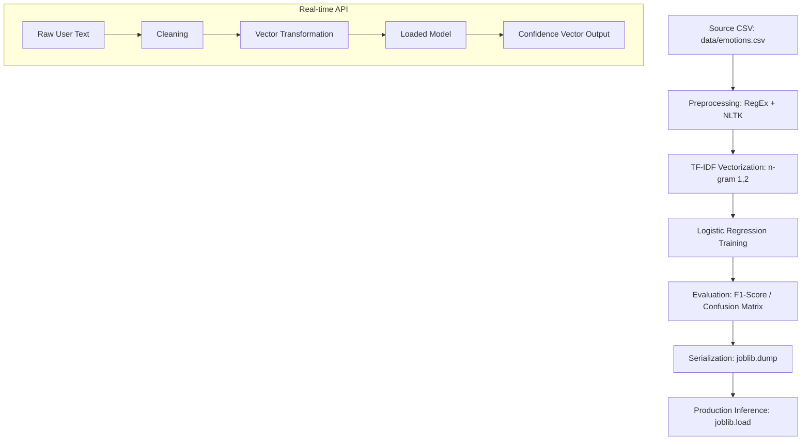

# Machine Learning Pipeline Specification

The MindSync AI emotion analysis engine is built on a supervised linguistic classification framework. It utilizes specialized feature extraction to identify psychological markers in conversational English.

## Pipeline Lifecycle Diagram

## Technical Processing Workflow

### 1. Linguistic Preprocessing
Input data is normalized through a deterministic cleaning pipeline:
- **Normalization**: Conversion to lower-case to ensure case-insensitivity.
- **Noise Reduction**: Application of regular expressions to strip non-alpha characters and punctuation.
- **Stopword Filtering**: Removal of high-frequency English words via the NLTK corpus (e.g., "the", "and", "is") to isolate sentiment-rich tokens.

### 2. Feature Engineering (TF-IDF)
The engine transforms textual tokens into a numerical vector space using Term Frequency-Inverse Document Frequency.
- **Objective**: Penalize common terminology and amplify weights for unique emotional indicators (e.g., "desperate", "joyful").
- **Configuration**: The vectorizer utilizes an n-gram range of (1, 2). This allows the model to capture bigrams such as "not happy," preserving important contextual negations.

### 3. Classification Algorithm (Logistic Regression)
A Logistic Regression model is employed to predict the probability of class membership across five emotional categories: Happy, Sad, Angry, Anxious, and Neutral.
- **Inference Method**: The model uses the `predict_proba()` method to return a confidence vector, allowing the system to handle edge cases with low-confidence scores.
- **Serialization**: The trained pipeline is serialized into a `.pkl` format using Joblib for deployment in the FastAPI production environment.

## Model Evaluation and Optimization

The pipeline is validated against an 80/20 train-test split. The following metrics are prioritized:
- **F1-Score**: To ensure balanced performance between Precision and Recall across all emotion classes.
- **Confidence Thresholds**: Inference results are accompanied by a percentage-based score used for filtering low-fidelity responses in the user interface.

## Training Procedures
To execute a model retraining cycle:
1. Populate `ai-service/data/emotions.csv` with a new labeled dataset.
2. Execute `python train.py`.
3. Review the generated `classification_report` for performance anomalies.
